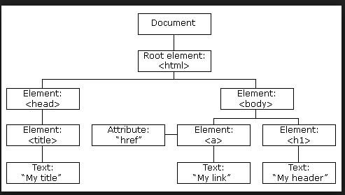
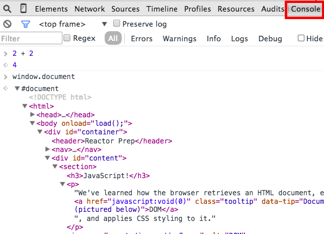

# JavaScript & the DOM

## Objectives

* Open and use the JavaScript Console REPL to evaluate simple expressions
* Command the browser to console.log, alert, and prompt
* Use `<script>` tags to add simple JavaScript functionality to our HTML documents

### JavaScript!

We've learned how the browser retrieves an HTML document, either from the hard drive or over a network connection, loads it into memory as a [DOM], and renders it to the page with CSS styling applied.



We can view the page, scroll around, click on a link to change pages, or submit a form. But other than that, once the page is rendered to the screen, it is functionally inert.

If we want more complex interactive behavior we need to use a [scripting language](https://en.wikipedia.org/wiki/Scripting_language) like JavaScript to describe what should happen when and how.

Before we start throwing down `<script>` tags or creating our own `.js` files, let's write a few lines by hand. Go ahead and open up your Chrome Developer Tools and switch to the **JavaScript Console.** The JavaScipt Console is a [REPL](https://en.wikipedia.org/wiki/Read%E2%80%93eval%E2%80%93print_loop): Read Evaluate Print Loop.



A REPL waits for the user to input an instruction and press ENTER to signal they're done. The interpreter then READs the command, EVALUATEs (runs/ executes/ resolves) it, PRINTs the result, and LOOPs back to wait for another command..


### The JavaScript Runtime Environment

First off let's prove to ourselves that we are still living in the same world. Use the JavaScript console to instruct the browser to show you the DOM. (The `>` indicates that we are typing into a JavaScript REPL, not writing code in a file to be run later, omit it)

*   `> window.document`

Open it up and take a look! The `window` object holds the state of (information about) the currently open browser tab. It contains many **properties** (simply put: associated pieces of data), of which, the DOM (document) is one. Here are a few more, **check 'em out**

*   `> window.location`
*   `> window.history`

You can also look at the window object directly, but be warned, **it's intense!**

*   `> window`

Any of the properties listed can be accessed using the **dot notation** property access format as seen above with the document, location, and history properties of the window object (we'll learn more about objects later). **Try accessing a few.**

Great, so we see that we're living in the same world, but how do we actually interact with the page? Make it respond to user actions? Change over time according to our wishes?

Well, we've got to take a few steps back to answer those questions. So strap yourself in... **JavaScript here we come!**


### The Number data type

#### Exercise

Each of the following lines of code is an expression. An expression is a series of values, variables, and operators that, when interpreted, return a value. For example: `2+3` is an expression that evaluates to 5.

Type each of the following expression into the console one at a time and consider the result.

*   `> 2 + 3`
*   `> 3 * 5 + 4`
*   `> 3 * (5 + 4)`
*   `> -300 * 2.57`
*   `> 25%6` <-- The modulo operation returns the remainder after divison
*   `> 1e4 * 2`

**What have we learned?** We can use the console as a simple caluculator by employing values with the data type of number and combining them with mathematical operators such as `+`, `-`, `*`, `/`, `%`.

### Exercise 1:

From the console, calculate how many seconds old you are. Approximate by rounding to the nearest year or month.

### The String data type

*   `> "Hello, how are you?"`

The string data type denotes a sequence of alphanumeric characters which are often useful for communicating information to weak-minded humans who aren't able to interact using pure logic.

What happens if we try to type the following into the console without the quotes? Try it and find out!

*   `> Hello, how are you?`

The reason that you get an error is because the JavaScript interpreter (the program that reads your JavaScript code and figures out what to do with it) interprets your sentence as a **command** instead of a **string**

We can evaluate non-numerical expressions as well. **To what value does the following expression resolve when evaluated?**

*   `> 'Just fine,' + ' ' + 'thank you'`

String concatenation is the operation of joining character strings end-to-end.

### Alerting, Logging, and Prompting, oh my!

Not only does the `window` object give us access to the current browser tab's state, we can also use it to issue commands to the browser. **What does this command do? Try it.**

*   `> window.alert("Jello, whirled")`

Similar to the Terminal, the first part of the command references what we're looking to run. Next comes the invokation operator `()` - similar to a mathematical operator ( +, -, * ) - which causes the JavaScript interpreter to actually run the function (we'll learn more about these later). Inside the parentheses we place the arguments we wish to pass as input; in this case the string to be displayed.

The expression `2 + 3` resolves to the **value** 5. What value does the following expression resolve to? What is its **data type**? Because the JavaScript console is a REPL, you can find out by simply executing the command; the console will print out what the command evaluates to right after you execute it.

*   `> window.prompt("How are you feeling today?")`

`window.prompt` and `window.alert` are used so frequently that shortcuts were created. The "window" portion can be omitted, and the functions will still work.

*   `> alert("Jello, whirled")`
*   `> prompt("How are you feeling today?")`

### `<script>` tags

Okay great, but I thought a scripting language was going to let us automate our work right? Typing things into the console isn't web scale!

In the same way that a `<style>` tag tells the browser to switch from the HTML interpreter to the CSS interpreter to read code inside it, the `<script>` tag tells the browser to interpret its contents according to the rules of JavaScript.

    <html>
      <head>
      </head>
      <body>
        <h1>mah payge</h1>
        <p>yup, yup</p>

        <script>
          // the interpreter will skip any line that starts with a double slash
          // these lines are explanatory comments to help squishy-brained humans

          alert("Welcome to mah deng website, brah!")
          prompt("How's it going?")
        </script>
      </body>
    </html>

Always, always, always, always, always, always, always place your script tags **directly before the closing** `<body>` **tag** in your HTML document. Always. Always. If you follow this simple rule, you will save yourself several dozen frustrating hours of debugging over the course of your career. You're welcome.

### Exercise 2: My First JavaScript Enabled Web Page

1.  Create a new HTML document, correctly set up with html, head, and body tags
2.  Add a script tag **directly before the closing body tag**.
3.  Inside of a script tag, alert visitors that your site is extremely awesome and should thus be enjoyed with caution.
4.  Prompt the user for their name
5.  Greet them by name using another alert

In steps 4 and 5, the word `alert` came before the word prompt. **Why did the prompt happen first?** I highly recommend you not move past this point until you can answer this question for yourself. Ask for help if you need to.

### Console.log(X)
Ok, though illustrative, alerts are annoying. That's why they're not often used. It is more usual to use the console to output information. **Try this:**

```html
<script>
  window.console.log("Where is this message displayed?")
</script>
```

Or, more succinctly:

```html
<script>
  console.log("This is mostly used for debugging.", "We'll learn how to write directly into the HTML document a little later.")
</script>
```

#### Exercise

Ask the user what their favorite sports team is. Secretly log a message trash-talking their team in the console.

#### Exercise

1.  Go back through your past projects and add a `<script>` tag at the bottom of each page, right before the `</body>`.
2.  Add some secret console.log goodness to each.
3.  Add more JavaScript as you see fit.

* * *

### Variables

In programming, it can be extremely useful to store values for later use. Variables are identifiers (labels, nametags) used to set and retrieve stored values. They are called variables because you can change what value they hold based on user input, the current program state, etc.

We use the `var` keyword to declare a variable. When first declared, variables have a value of `undefined`. The assignment `=` stores a value. **Type along in your console:**

*   `> var x`
*   `> x`
*   `> x = 1`
*   `> x + 4`
*   `> x`
*   `> x = 5`
*   `> var y = 2`
*   `> x + y + 7`
*   `> y = x + 7`

So when we write `var rate = 100` your JavaScript Runtime Environment jots down the variable "rate" in its ledger and gives it a pointer to a memory location:


#### Exercise

Type the following in your console one line at a time (ignore the comments):

*   `> my_variable` // what does this error mean?
*   `> var my_variable`
*   `> my_variable` // what has changed from the first line?
*   `> my_variable = "I'm a string value!"`
*   `> typeof my_variable`

#### Exercise

*   `> var first, second`
*   `> first = "hello"`
*   `> second = "goodbye"`
*   `> first = second`
*   `> second = "wait, you've forgotten your hat!"`

What are first and second equal to after executing all those commands? Are they the same or different? In JavaScript, primitives (numbers, strings, booleans) are **pass by value**. This means that when you set one variable equal to another, the value stored there is copied over, and the two variables retain no lasting connection to each other. This is another exercise that you should not move past until you really understand it. Feel free to ask for help!

**Hint:** After executing all of the commands above, try executing two more:

* `> console.log(first)`
* `> console.log(second)`

How do the results relate to the "pass by value" concept described earlier?

**Note:** Objects are **pass by reference**, not **pass by value**, but we'll learn about that later.

* * *

Now try some on your own:

### Exercise 3:

1.  Declare variables a, b and c. Assign a number to each.
2.  Declare variable d and assign it the value of a, b, and c added together.
3.  Re-assign the value of b to a. Then change the value of b. What is the value of a?

### Exercise 4:

1.  Create variables "hour" and "minute" to reflect the current time.
2.  Write an expression to calculate how many seconds until midnight.
3.  Change "minute" to be accurate again as time has probably passed.
4.  Run the same calculation again (press the up key in the console to scroll back to it).

### Exercise 5:

1.  Declare at least 10 variables such as 'name', 'age', 'birthday', 'hometown', 'occupation', 'favoriteFood', 'bestFriend', etc, and set their values equal to strings containing the appropriate information about yourself.
2.  console.log a paragraph about yourself using the appropriate variables to insert the relevant information in the appropriate places.
3.  Create a new HTML document and re-write the variables and the console.log in a `<script>` tag so that you'll have it for later.

### Manipulating the DOM

`console.log` is great for debugging, but more frequently, we'll want our JavaScript to change the visible page. First, let's ask the document to return us the first element that it finds that matches a valid CSS selector.

Open [this page](resources/dom_example.html) (you may need to copy and paste the html into a new file and save it) and try the following in the JavaScript console:

*   `> document.body`
*   `> document.querySelector('p')`
*   `> document.querySelector('#primary')`
*   `> document.querySelector('.important')`
*   `> document.querySelector('p.important').textContent`
*   `> document.querySelector('#nav ol li').textContent`
*   `> document.querySelector('h1, p').textContent = "I'm on the page!"`

### Exercise 6:

1.  Open up one of your previous HTML projects
2.  Use the console to retrieve the first element that matches a particular CSS selector.
3.  View that element's current textContent from the console.
4.  Set that element's textContent to a new string.
5.  Do this exercise once for each selector type shown above.

Having trouble understanding how each of the query selectors work? Use this [handy reference](../../resources/query_selector_reference.md) to help decipher them!

### Exercise 7: Selector!

*   `> document.querySelector('h1').textContent = "Behold! For I am a mighty web document!"`
*   `> var big_shot = document.querySelector('#primary')`
*   `> big_shot.textContent = "Flippin' heck, I'm by far the most important element around!"`
*   `> document.querySelector('.important').textContent = "Do all .important elements change or only one?"`


Design an HTML page with HTML elements to match the selectors used above. With that page loaded into the browser, type the above expressions into the console. **Do your changes persist if you reload the page? Why is this?**

Now move the JavaScript code into a script tag just before the `</body>`. **What's changed?**

### Exercise 8: Greeter!

1.  Create a fresh HTML document with correctly set up html, head, and body tags
2.  Create a `<div>` with an id of `greeting` on your web page.
3.  Prompt the user to enter their name. Set their response equal to a variable `visitor_name`.
4.  Create a variable called `welcome_message` and construct a welcoming message using their name.
5.  Make your welcome message visible on the page using querySelector and textContent.
6.  Prompt the user for their hometown and save their answer as a variable called `town`
7.  Put an empty `<span>` with the id of `hometown` on the page in the middle of an existing sentence already on the page letting them know how nice it is to have a visitor from ___ .
8.  Use the `town` variable and the `#hometown` span to make the compliment complete!

### Exercise 9: Shuffle!

1.  Create a `<div>` with an id of `source`, and one with the id of `destination`, each with some text inside.
2.  Fetch the textContent of `source` and save it as a variable.
3.  Use the variable to place that text in the `destination` div
4.  Create `<div>`s with a ids of `swap_1` and `swap_2`.
5.  How can we swap the textContent of the two divs?

### Exercise 10: Mad Libs!

1.  Create a "Mad Libs" web page. It should tell a story, leaving empty `<spans>`'s with id attributes of 'noun1', 'adjective2', 'verb3', etc. Practice using the console along with `querySelector` and `textContent` to fill in the missing information one at a time.
2.  After doing this manually, put these operations into a script tag, and use variables to store each word to be filled in before placing it into the web page, so that the template will be filled out automatically each time the page loads, but the information will be easy to change later.
3.  Finally, prompt the visitor repeatedly to provide their own mad libs words. Save their responses as variables and then place those variables into the page to make a crazy story for them.

### Extra Credit

#### Advanced Mathematical Operators

Play with the following in your console until you understand how they work:

    num = 1
    num = num + 5

    // assignment
    num += 5
    num -= 1
    num *= 3
    num /= 0.5

    // increment and decrement
    num++
    num--

    // operators before the variable
    // what's the difference?
    ++num
    --num

#### Escaping Strings

`> "Well now...\nThis is " + "rather clever, \n\tdon't you think?"`

An escape character indicates an alternative interpretation of the subsequent character in a character sequence. In JavaScript the slash character denotes that the character after it might be a tab (\t) or new line (\n).

`> '"Single quotes work too" ,she said.' + " " + 'Though I\'d not thought it possible'`

Escape characters may be needed to indicate that we're looking to print a literal single (\') or double quote (\") and not signal the end of a string of text.

**Fix the following so it will run successfully in your console:**

`'"What's wrong with the pudding?", she'd say with a smile.'`

**Now this one:**

`'I'd often think' * "to myself, "Well, what's the worst wrong that could go wrong?". I guess" * "now we know..."`
