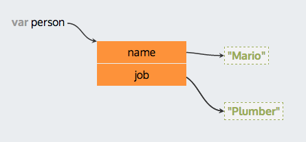
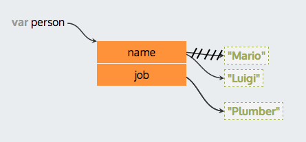

# Lesson 9: Objects

JavaScript has two built-in [associative array](//en.wikipedia.org/wiki/Associative_array) data types to help us store and work with collections of values: Objects, which are collections of values accessible at arbitrary string keys, and Arrays which are collections of values accessible at sequential integer keys. We'll go over Objects today, and Arrays in our next lesson (because they're actually just objects!)

**Note:** There are many code snippets in this lesson. Please try them all out on your own, but do **not** copy and paste them.

This is an object:

```javascript
var person = {
  "name": "Mario",
  "job": "Plumber"
}

person["name"] // "Mario"
person["job"] // "Plumber"
```



We can use the bracket syntax to access and set values

```javascript
person['name'] = 'Luigi'
```



We can declare empty objects and assign key-value pairs later

```javascript
var person = {}

person["name"] = "Mario"
person["job"] = "Plumber"

person["name"] // "Mario"
person["job"] // "Plumber"
```

### Exercise 1:

1.  Create a variable called `my_cat` and assign to it an empty object
2.  Assign `my_cat` a `name` property, which should hold a string value
3.  Add an `age` property holding an integer value
4.  Add an `alive` property holding a boolean value
5.  Add at least four more properties such as `favorite_toy`, and `napping_spot`

Something to note- because property keys are always string values, quotation marks are optional:

```javascript
var person = {
  "name": "Mario",
  "job": "Plumber",
  "age" : 55,
  "licensed": true
}

//this does the same thing
var person = {
  name: "Mario",
  job: "Plumber",
  age : 55,
  licensed: true
}
```

Often times we access properties of our objects using variables instead of string literals:

```javascript
var human = {}
human['name'] = 'bob'
human['age'] = 75

var property = 'age'

// what property key are we referencing here? what is its value?
human[property]

property = 'location'

// at what key will we find the value "San Francisco"? Test it out to make sure you're right.
human[property] = 'San Francisco'
```

### Exercise 2:

1.  Create a variable called `my_dream_life` and assign to it an empty object
2.  Create a variable called `property_key` and assign to it the string value `"job"`
3.  Use the `property_key` variable, not the literal string `"job"` to add a `job` property to your dream life object. Hint: `my_dream_life[property_key] = 'some job'`
4.  Create a variable `another_property_key` and give it a value "salary".
5.  Use `another_property_key`, not the literal string `"salary"`, to quantify the value of human life.
6.  What does `my_dream_life[property_key]` return?
7.  What does `my_dream_life["job"]` return?
8.  Assign a string `"car"` to the variable `next_property`
9.  Use the variable `next_property` to add your dream car to your dream life object.
10.  What does `my_dream_life[next_property]` return?
11.  What does `my_dream_life["car"]` return?
12.  Assign `my_dream_life` three more properties (with values) using variables rather than literal strings and access them each using variables as well

## Dot Notation

We use the `person["job"]` syntax so often, JavaScript decided to include a more confusing way to do the same thing: `person.job`. It's called **dot notation** as opposed to the **bracket notation** we used earlier.

```javascript
var car = {
  make: "Toyota"
}

car["model"] = "Camry"
car["model"] // what does this evaluate to?
car.model // what does this evaluate to?

car.model = "Prius"
car["model"]
car.model

var prop = 'year'
// how can we set the car's year using the variable prop?
```

### Exercise 3:

1.  Which should we use above: `car[prop] = 1992` or `car.prop = 1992`? Try both ways!
2.  What happens when you ask for a property that is not registered to the object? i.e. to what value does the expression `car['nothing_here']` resolve to? what about `car.nothing_here`?
3.  Create your own `dream_car` object.
4.  **Use dot notation** to add properties `make`, `model`, and `color` with values of type string, `year` with a value of type number, and `registered` with a value of type boolean.

#### Exercise:

On lines ending '??', figure out what the expression will evaluate to. **First form a hypthosis**, then **try it in the console**.

```javascript
var demo_object = {
    one: 1,
    two: 2,
    three: 3
}
var one = "three"

demo_object['two'] // ??
demo_object[one] // ??

var state_capitals = {
    California: 'Sacramento',
    Texas: 'Austin'
}

var place = 'California'

state_capitals['place'] // ??
state_capitals.place   // ??
state_capitals[place] // ??

state_capitals['California'] // ??
state_capitals.California   // ??
state_capitals[California] // ??
```

Sometimes we'll want to iterate over every property in an object. Since we don't know the names of the keys beforehand, and the keys aren't sequential integers, we can't use a while loop. There is a special language-level statement to handle this, the `for in` loop.

```javascript
var obj = {
    greeting: 'howdy',
    direction: 'down',
    color: 'red',
    'spaces-and-dashes can be used': ' but need to have quotes'
}

for (var key in obj) {
    console.log(obj[key]) //why don't we need quotes around key??
    // what would happen if we logged obj.key instead? Why? Test it.
}
```

### Exercise 4:

1.  Use a `for in` loop to iterate over your `cat`, `dream_car` and `dream_life` objects. Re-write the loop from scratch each time and use a variable name other than `key` for each one.
2.  Use a `for in` loop to search `obj` for the key `color` and print its value to the console.
3.  Search `obj` for the value `"down"`, and append its key into the div.
4.  Create a variable `target_key` and assign it a string `"greeting"`. Use the `target_key` variable and `for in` to find the `greeting` property and log its value.

## String Operations

```javascript
var greeting = "Hello and welcome!"

greeting[0] // "H"

!!greeting.match("welcome") // true
!!greeting.match("goodbye") // false

var words = greeting.split(' ')
```

#### Exercise 5:

1.  Loop through the politicos object and concatenate everyones names together, separated by a space. Final result should look something like this: 'hillary clinton barack obama michelle obama joe biden jerry brown'
2.  Loop through the politicos object and count the number of people whose name contains the word "obama".

```javascript
var politicos = {
    secretary_of_state: 'hillary clinton',
    potus: 'barack obama',
    flotus: 'michelle obama',
    vice_prez: 'joe biden',
    gov_of_california: 'jerry brown'
}
```

#### Exercise 6:

1.  Create a new empty object `b_named_politicos`
2.  Console.log any politico whose first OR last name starts with a 'b' as a property of the `b_named_politicos` object with their job title as the key and their name as the value
3.  Create a new empty object called `reverse_politico_lookup` by iterating over the politicos object and adding each person to the `reverse_politico_lookup` object with their name as a key and their job title as the value. The final object should look something like this:

```javascript
var reverse_politico_lookup = {
    'hillary clinton': 'secretary_of_state',
    'barack obama': 'potus',
    'michelle obama': 'flotus',
    'joe biden': 'vice_prez',
    'jerry brown': 'gov_of_california'
}
```

### Complex Objects

Objects can hold values of any data type. That includes arrays, functions (we'll learn about both of those soon), and even objects.

```javascript
var complex_object = {
  string: "I'm a string!",
  number: 42,
  //don't worry about this too much yet, just accept thats its a different data type
  array: ["all sorts of stuff", 10, true, undefined, function(){console.log('beepity-beep')}],
  //we haven't covered functions yet either, just accept that they too can be stored in objects
  fn: function(){
    console.log("fn has been invoked! Checking both kinds of invocation-time inputs...")
    console.log("what is my calling context?", this)
    console.log("what are my arguments?", arguments)
  },
  //Now THIS is interesting, an object INSIDE of an object!?
  simple_object: {name: 'bob', location: 'basement'},
}

complex_object.string
complex_object.array[4]
complex_object.simple_object.name
complex_object.fn("stuff", "more stuff", "even more stuff!")
```

#### Exercise 7:

1. Try console logging all of the values in `complex_object`
2. `simple_object` is an object inside of an object. How might we access its properties? Try to console log the value of the "name" property inside of simple_object (which is nested inside of complex_object)
3. Try to use a `for in` loop to console log all of the properties inside of `simple_object`
4.  Create your own complex object. How deep can you nest objects inside of each other? Are you still able to access the properties of the nested object?


## Extra Credit / Nightmare Mode

Did you know that almost every data type in Javascript is an object? Puzzle over this:

```javascript
//strings
typeof "asdf"; // "string"

"asdf".length; // 4

"asdf".replace('asdf', 'apple'); // "apple"

//numbers
(10).toString; // "10"
```

The above examples demonstrate that almost everything in JavaScript is an object, and have properties just like regular objects. However, primitives don't behave exactly like regular objects because they are immutable. This means that you can't directly add or remove properties. Try this:

```javascript
var testString = 'Hello'; // "Hello"
testString.greeting = 'Welcome!'; // "Welcome!"

console.log(testString.greeting); // undefined
```

That's pretty straightforward, but what about this:

```javascript
var testString = 'Hello'; // "Hello"
testString.constructor.prototype.greeting = 'Welcome!' // "Welcome!";

console.log(testString.greeting); // "Welcome!"
```

To understand why *that* worked you'll have to dive deep into the strange and mysterious world that is JavaScript prototypical inheritance. This topic will take you a very long time to understand, and will frustrate you immensely, but eventually you'll get it :) [This](http://eloquentjavascript.net/06_object.html) is a great place to start
